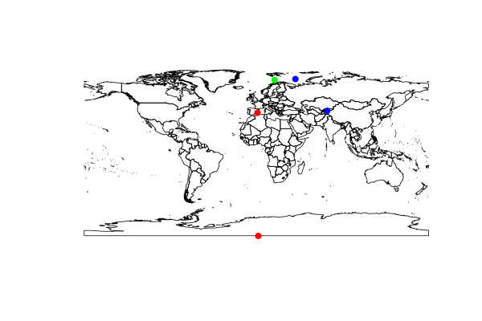
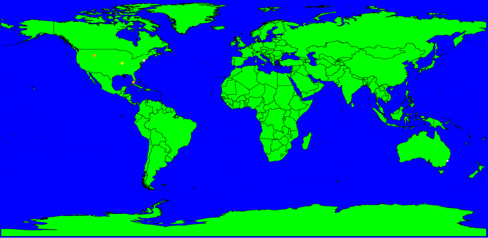
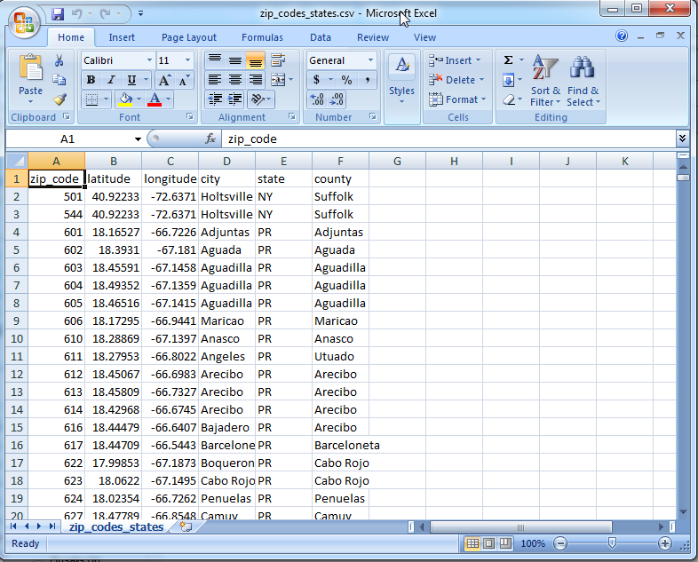
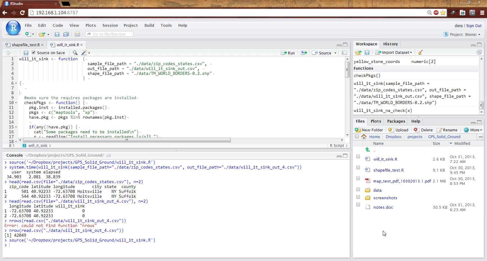
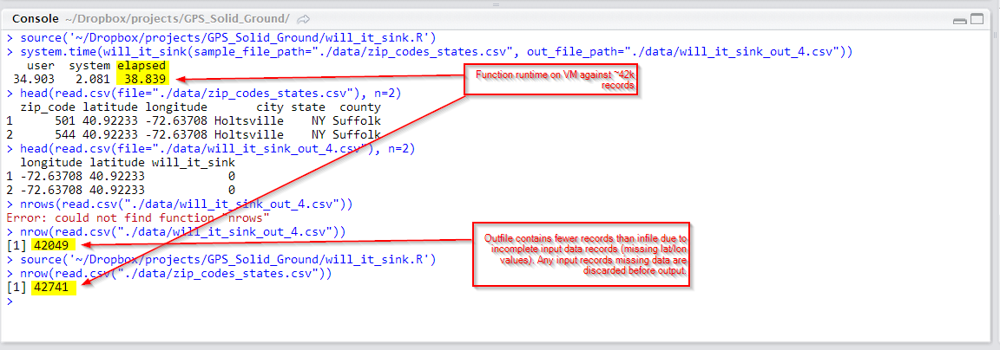
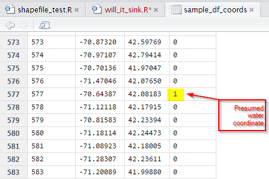
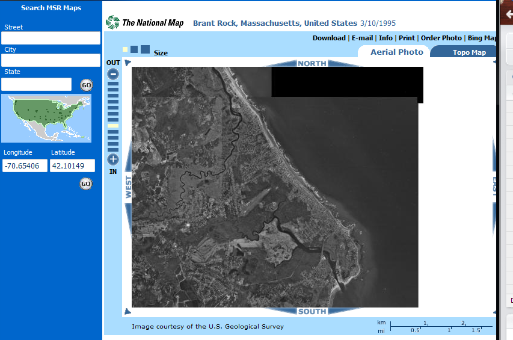
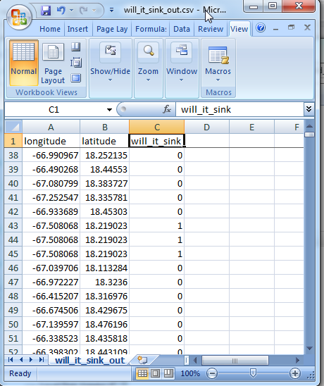

# Will it Sink?
*That is the Question*

Attempt to determine if a GPS coordinate is in the water or on land using point-in-polygon operations and shape files.

- [Will it Sink?](#will-it-sink)
  - [Initial Exploration](#initial-exploration)
  - [Demo](#demo)
    - [Execution via RStudio Server](#execution-via-rstudio-server)
    - [Source Code](#source-code)
  - [References and Further Reading](#references-and-further-reading)

## Initial Exploration
 - [Exploration](shapefile_test.R) was performed using the [World Borders Dataset Provided by Bjorn Sandvik](http://thematicmapping.org/downloads/world_borders.php)
    - This dataset was useful for development and proof of concept, but if we want to include internal bodies of water (e.g. lakes), we'd need a different shapefile.
- Plotted coordinates and shapes as a map. Visualization aided in debugging during exploration.
  - 
  - 

## Demo
### Execution via RStudio Server
- Starting shapefile set and a csv file containing GPS coordinates
  - 
  - 
- Developed and Executed point-in-polygon code using RStudio Server
  - 
- Initial performance and result Analysis
  - 
  - 
- Spot checked results using aerial satellite imagery from MSR
  - 
- CSV output produced for further research
  - 

### Source Code
- [Driver](will_it_sink_driver.R)
- [will_it_sink function code](will_it_sink.R)

## References and Further Reading
- [GIS Stackexchange discussion on the Separation of Land - Body waters](http://gis.stackexchange.com/questions/21555/separation-of-land-body-waters)
- [How to use shapefiles doc on CRAN](http://cran.r-project.org/web/packages/spatstat/vignettes/shapefiles.pdf)
- [CRAN spatial ref page](http://cran.r-project.org/web/views/Spatial.html)
- [point-in-polygon example from the National Center for Ecological Analysis and Synthesis](http://www.nceas.ucsb.edu/scicomp/usecases/point-in-polygon)
- [OpenStreetMap Shapefiles wiki](https://wiki.openstreetmap.org/wiki/Shapefiles)

